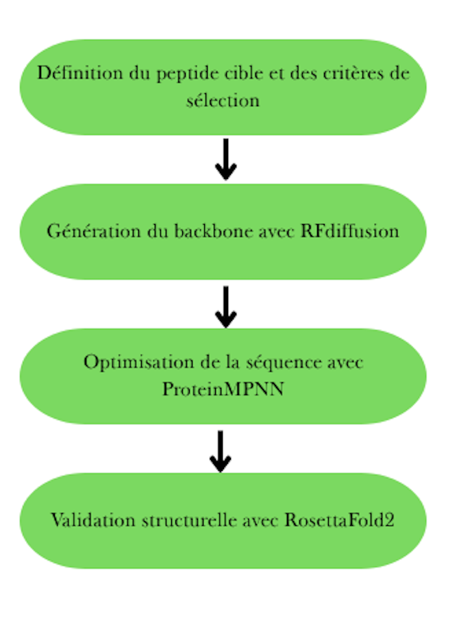

# rfpeptides-cyclic-peptides
Template summarizing an RFpeptides-like pipeline: RFdiffusion → ProteinMPNN → RoseTTAFold2 (GPU/SLURM, Singularity). Mock data only.

# RFpeptides Template (Cyclic Peptide Design)

## Overview
This repository summarizes my internship work reproducing (part of) the RFpeptides pipeline:
**RFdiffusion** for backbone generation → **ProteinMPNN** for sequence design → **RoseTTAFold2 (RF2)** for conformational validation.  
Runs were executed on HPC with **SLURM** and **Apptainer/Singularity** (GPU).

> This is a **template**: no real data or proprietary models; only example scripts and placeholders.

## Workflow

1. **Backbone generation (RFdiffusion)** – sample cyclic backbones.
2. **Sequence design (ProteinMPNN)** – design sequences onto backbones.
3. **Validation (RF2)** – predict 3D structures and collect **pLDDT**.
4. **QC / scoring** – compute **RMSD** to native (when available) and plot pLDDT vs RMSD.
5. **HPC** – batch jobs via SLURM; containerized with Apptainer/Singularity.

## Skills / Stack
Python, Bash, GPU jobs (A100), SLURM, Apptainer/Singularity, RFdiffusion, ProteinMPNN, RF2, data wrangling & plotting.

## Repo layout
